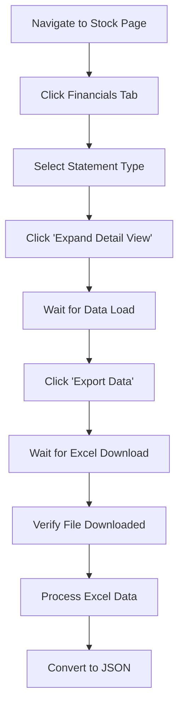
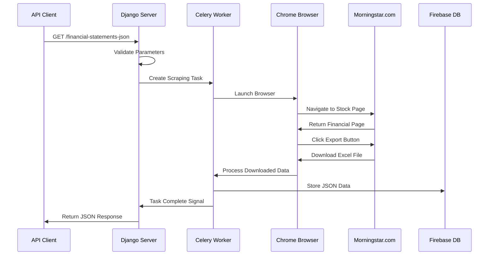

# Stock Data Web Scraper - How It Works

## Table of Contents
1. [Application Overview](#application-overview)
2. [How the Web Scraping Works](#how-the-web-scraping-works)
3. [User Journey and Workflows](#user-journey-and-workflows)
4. [API Processing Flow](#api-processing-flow)
5. [Data Extraction Process](#data-extraction-process)
6. [Background Task Processing](#background-task-processing)
7. [Data Storage and Retrieval](#data-storage-and-retrieval)
8. [Error Handling and Recovery](#error-handling-and-recovery)
9. [Performance Optimization](#performance-optimization)
10. [Security and Stealth Features](#security-and-stealth-features)

---

## Application Overview

The **Stock Data Web Scraper** is an intelligent automation system that extracts financial data from Morningstar.com in real-time. The application serves as a bridge between users seeking financial data and the complex web-based financial information systems.

### What the Application Does

**Primary Function**: Automatically navigates to Morningstar.com, locates specific stock information, extracts financial statements, and delivers the data in user-friendly formats (JSON API responses and Excel files).

**Key Capabilities**:
- 🤖 **Automated Browser Control**: Uses Chrome browser automation to interact with websites like a human user
- 📊 **Multi-Format Data Extraction**: Supports 8 different types of financial data
- 🔄 **Asynchronous Processing**: Handles multiple requests simultaneously without blocking
- 📱 **Dual Interface**: Both web interface for manual use and API for programmatic access
- 🛡️ **Anti-Detection Technology**: Advanced stealth features to avoid bot detection
- 🌐 **Global Accessibility**: Open access API available worldwide

---

## How the Web Scraping Works

### Step-by-Step Scraping Process

#### 1. Browser Initialization
```
┌─────────────────────────────────────────────────────────────────┐
│                    BROWSER STARTUP SEQUENCE                     │
├─────────────────────────────────────────────────────────────────┤
│ 1. Launch Chrome with stealth configuration                     │
│ 2. Set user agent to mimic real browser                         │
│ 3. Configure download directory for files                       │
│ 4. Apply anti-detection measures                                │
│ 5. Set window size and display options                          │
└─────────────────────────────────────────────────────────────────┘
```

**Technical Details**:
- Uses `undetected-chromedriver` to avoid bot detection
- Randomizes user agents from a pool of realistic options
- Configures Chrome flags for container optimization
- Sets up download preferences for Excel file handling

#### 2. Website Navigation
```
Navigation Flow:
User Input (AAPL, XNAS) → Build Morningstar URL → Navigate to Page
                                      ↓
Check Page Load Success → Wait for Elements → Verify Stock Found
                                      ↓
Click Financial Tab → Wait for Content → Navigate to Statements
```

**URL Construction Example**:
```
Base URL: https://www.morningstar.com/stocks/
Market Code: XNAS (NASDAQ)
Ticker: AAPL
Final URL: https://www.morningstar.com/stocks/xnas/aapl/quote
```

#### 3. Data Extraction Workflow



**Interactive Elements**:
- **Financials Tab**: Located in the main navigation menu
- **Statement Selector**: Dropdown for Income Statement, Balance Sheet, Cash Flow
- **Expand Detail View**: Button to show complete data
- **Export Data**: Downloads Excel file with raw financial data

#### 4. Data Processing Pipeline

```
Excel File → Pandas DataFrame → Data Cleaning → JSON Conversion
     ↓              ↓               ↓              ↓
File Validation → Column Mapping → Remove NaN → Format Output
     ↓              ↓               ↓              ↓
Size Check → Standardize Names → Fill Blanks → API Response
```

---

## User Journey and Workflows

### Web Interface User Journey

#### Step 1: User Accesses the Application
```
┌────────────────────────────────────────────────────────────────┐
│                       WEB INTERFACE                            │
├────────────────────────────────────────────────────────────────┤
│  Data Type: [Income Statement        ▼]                       │
│  Ticker:    [AAPL                   ]                         │
│  Market:    [XNAS                   ]                         │
│                                                                │
│  [ Scrape Data ]  [ Download All ]                            │
└────────────────────────────────────────────────────────────────┘
```

**User Actions**:
1. **Select Data Type**: Choose from 8 available financial data types
2. **Enter Ticker**: Input stock symbol (e.g., AAPL, TSLA, MSFT)
3. **Specify Market**: Enter market code (e.g., XNAS, NYSE)
4. **Initiate Scraping**: Click "Scrape Data" button

#### Step 2: Processing Screen
```
┌────────────────────────────────────────────────────────────────┐
│                    PROGRESS TRACKING                           │
├────────────────────────────────────────────────────────────────┤
│  Status: Scraping Financial Data...                           │
│                                                                │
│  Progress: ████████████░░░░░░░░ 60%                          │
│                                                                │
│  Current Step: Downloading Excel file from Morningstar        │
│  Elapsed Time: 1 minute 23 seconds                            │
│                                                                │
│  [ Cancel Process ]                                            │
└────────────────────────────────────────────────────────────────┘
```

**Real-time Updates**:
- Progress bar showing completion percentage
- Current step description
- Elapsed time counter
- Option to cancel long-running processes

#### Step 3: Results and Download
```
┌────────────────────────────────────────────────────────────────┐
│                      RESULTS READY                             │
├────────────────────────────────────────────────────────────────┤
│  ✅ Data extraction completed successfully!                    │
│                                                                │
│  Company: Apple Inc. (AAPL)                                   │
│  Market: NASDAQ (XNAS)                                         │
│  Data Type: Income Statement                                   │
│  Records: 45 financial metrics over 5 years                   │
│                                                                │
│  [ Download Excel ] [ View JSON ] [ Start New Scrape ]        │
└────────────────────────────────────────────────────────────────┘
```

### API User Journey

#### Direct API Access Flow
```
API Request → Parameter Validation → Task Creation → Queue Processing
     ↓               ↓                    ↓               ↓
HTTP GET → Check Required Fields → Celery Task → Worker Assignment
     ↓               ↓                    ↓               ↓
JSON Response ← Data Formatting ← Scraping Complete ← Browser Automation
```

**API Request Example**:
```bash
curl "YOUR_DOMAIN_HERE/financial-statements-json?ticker=AAPL&market=XNAS&type=is"
```

**Processing Steps**:
1. **Request Validation**: Check for required parameters (ticker, market, type)
2. **Task Queue**: Add scraping job to Celery background queue
3. **Worker Processing**: Dedicated worker performs browser automation
4. **Response Delivery**: Return JSON data or error message

---

## API Processing Flow

### Request Processing Architecture



### Parameter Processing

**Required Parameters**:
- `ticker`: Stock symbol (validated against common patterns)
- `market`: Market identifier (e.g., XNAS, NYSE, LSE)
- `type`: Data type (`is`, `bs`, `cf` for Income Statement, Balance Sheet, Cash Flow)

**Parameter Validation Logic**:
```python
def validate_parameters(request):
    errors = []
    
    # Check ticker format
    if not re.match(r'^[A-Z]{1,10}$', ticker.upper()):
        errors.append("Invalid ticker format")
    
    # Validate market code
    valid_markets = ['XNAS', 'NYSE', 'LSE', 'TSE', 'ASX']
    if market not in valid_markets:
        errors.append("Unsupported market code")
    
    # Check data type
    if type not in ['is', 'bs', 'cf']:
        errors.append("Invalid data type")
    
    return errors
```

### Response Format Standardization

**Success Response Structure**:
```json
{
  "status": "success",
  "company": "Apple Inc.",
  "ticker": "AAPL",
  "market": "XNAS",
  "data_type": "Income Statement",
  "periods": ["TTM", "2022-12", "2021-12", "2020-12", "2019-12"],
  "data": {
    "Revenue": [394328000000, 365817000000, 294135000000, 260174000000, 265595000000],
    "Gross Profit": [170782000000, 152836000000, 152836000000, 104956000000, 98392000000],
    "Net Income": [99803000000, 94680000000, 57411000000, 55256000000, 48351000000]
  },
  "currency": "USD",
  "last_updated": "2024-01-15T10:30:00Z"
}
```

**Error Response Structure**:
```json
{
  "status": "error",
  "error_code": "INVALID_TICKER",
  "message": "Ticker symbol not found or invalid",
  "details": "The ticker 'XYZ123' could not be found on Morningstar",
  "timestamp": "2024-01-15T10:30:00Z"
}
```

---

## Data Extraction Process

### Selenium Automation Workflow

#### Browser Control Sequence
```
1. Initialize Chrome Driver
   ├── Set stealth options
   ├── Configure user agent
   ├── Set download directory
   └── Apply container optimizations

2. Navigate to Target URL
   ├── Construct Morningstar URL
   ├── Handle redirects
   ├── Wait for page load
   └── Verify stock exists

3. Interact with Page Elements
   ├── Click Financials tab
   ├── Select data type
   ├── Click expand view
   └── Trigger export function

4. Handle File Download
   ├── Wait for download start
   ├── Monitor file creation
   ├── Verify file completion
   └── Process downloaded data
```

### Element Selection Strategy

**Robust Element Identification**:
```python
# Multiple selector strategies for reliability
SELECTORS = {
    'financials_tab': [
        "//a[contains(text(), 'Financials')]",
        "//button[@data-tab='financials']",
        ".tab-financials",
        "#financials-tab"
    ],
    
    'export_button': [
        "//button[contains(text(), 'Export')]",
        "//a[contains(@href, 'export')]",
        ".export-data-btn",
        "[data-action='export']"
    ]
}

def find_element_with_fallback(driver, selectors):
    for selector in selectors:
        try:
            if selector.startswith('//'):
                element = driver.find_element(By.XPATH, selector)
            else:
                element = driver.find_element(By.CSS_SELECTOR, selector)
            return element
        except NoSuchElementException:
            continue
    raise Exception("Element not found with any selector")
```

### Data Type Mapping

**Financial Statement Types**:
```python
DATA_TYPE_MAPPING = {
    'is': {
        'full_name': 'Income Statement',
        'tab_selector': 'income-statement',
        'export_format': 'annual',
        'expected_columns': ['Revenue', 'Cost of Revenue', 'Gross Profit', 'Operating Income', 'Net Income']
    },
    
    'bs': {
        'full_name': 'Balance Sheet',
        'tab_selector': 'balance-sheet',
        'export_format': 'annual',
        'expected_columns': ['Total Assets', 'Total Liabilities', 'Total Equity', 'Cash and Equivalents']
    },
    
    'cf': {
        'full_name': 'Cash Flow Statement',
        'tab_selector': 'cash-flow',
        'export_format': 'annual',
        'expected_columns': ['Operating Cash Flow', 'Investing Cash Flow', 'Financing Cash Flow']
    }
}
```

---

## Background Task Processing

### Celery Task Management

#### Task Queue Architecture
```
┌─────────────────────────────────────────────────────────────────┐
│                       TASK QUEUE SYSTEM                        │
├─────────────────────────────────────────────────────────────────┤
│                                                                 │
│  Web Requests → Django Views → Celery Tasks → Redis Queue      │
│                                      ↓                          │
│                               Task Distribution                  │
│                                      ↓                          │
│  Worker 1: Income Statement    Worker 2: Balance Sheet          │
│  Worker 3: Cash Flow          Worker 4: Dividends               │
│                                      ↓                          │
│                            Results Collection                    │
│                                      ↓                          │
│  Firebase Storage ← JSON Formatting ← Data Processing           │
│                                                                 │
└─────────────────────────────────────────────────────────────────┘
```

#### Task Lifecycle Management

**Task States**:
```python
TASK_STATES = {
    'PENDING': 'Task is waiting to be processed',
    'STARTED': 'Task execution has begun',
    'PROGRESS': 'Task is making progress (with percentage)',
    'SUCCESS': 'Task completed successfully',
    'FAILURE': 'Task failed with error',
    'RETRY': 'Task is being retried after failure',
    'REVOKED': 'Task was cancelled by user'
}
```

**Progress Tracking Implementation**:
```python
@shared_task(bind=True)
def scraper(self, ticker_value, market_value, download_type):
    progress_recorder = ProgressRecorder(self)
    
    # Step 1: Initialize browser
    progress_recorder.set_progress(10, 100, 'Initializing browser...')
    driver = create_stealth_driver()
    
    # Step 2: Navigate to website
    progress_recorder.set_progress(25, 100, 'Navigating to Morningstar...')
    driver.get(construct_url(ticker_value, market_value))
    
    # Step 3: Find and click elements
    progress_recorder.set_progress(50, 100, 'Locating financial data...')
    click_financials_tab(driver)
    
    # Step 4: Download data
    progress_recorder.set_progress(75, 100, 'Downloading Excel file...')
    trigger_export(driver)
    
    # Step 5: Process results
    progress_recorder.set_progress(90, 100, 'Processing data...')
    data = process_downloaded_file()
    
    # Step 6: Complete
    progress_recorder.set_progress(100, 100, 'Complete!')
    return data
```

### Timeout and Error Management

**Task Timeout Configuration**:
```python
CELERY_TASK_TIME_LIMIT = 300  # 5 minutes hard limit
CELERY_TASK_SOFT_TIME_LIMIT = 240  # 4 minutes soft limit

@shared_task(bind=True, time_limit=300, soft_time_limit=240)
def scraper_with_timeout(self, ticker, market, data_type):
    try:
        # Perform scraping operations
        result = perform_scraping(ticker, market, data_type)
        return result
    except SoftTimeLimitExceeded:
        # Clean up resources before hard timeout
        cleanup_browser_resources()
        raise
    except Exception as e:
        # Log error and prepare for retry
        logger.error(f"Scraping failed: {str(e)}")
        raise self.retry(countdown=60, max_retries=3)
```

---

## Data Storage and Retrieval

### Firebase Integration

#### Database Structure
```
Firebase Realtime Database Schema:
/
├── financial_data/
│   ├── {ticker}_{market}_{data_type}/
│   │   ├── company_name: "Apple Inc."
│   │   ├── ticker: "AAPL"
│   │   ├── market: "XNAS"
│   │   ├── data_type: "INCOME_STATEMENT"
│   │   ├── last_updated: "2024-01-15T10:30:00Z"
│   │   ├── periods: ["TTM", "2022-12", "2021-12"]
│   │   └── data: {
│   │       ├── "Revenue": [394328000000, 365817000000]
│   │       ├── "Net Income": [99803000000, 94680000000]
│   │       └── ...
│   │   }
│   └── ...
├── request_logs/
│   ├── {timestamp}/
│   │   ├── ip_address: "192.168.1.1"
│   │   ├── user_agent: "Mozilla/5.0..."
│   │   ├── ticker: "AAPL"
│   │   ├── market: "XNAS"
│   │   ├── endpoint: "/financial-statements-json"
│   │   └── status: "success"
│   └── ...
└── error_logs/
    └── {timestamp}/
        ├── error_type: "TICKER_NOT_FOUND"
        ├── message: "Stock symbol not found"
        └── stack_trace: "..."
```

#### Data Storage Process
```python
def store_financial_data(ticker, market, data_type, processed_data):
    # Create unique key
    key = f"{ticker}_{market}_{data_type}"
    
    # Prepare data structure
    firebase_data = {
        'company_name': processed_data.get('company_name'),
        'ticker': ticker,
        'market': market,
        'data_type': data_type,
        'last_updated': datetime.utcnow().isoformat(),
        'periods': processed_data.get('periods', []),
        'data': processed_data.get('financial_data', {}),
        'currency': processed_data.get('currency', 'USD'),
        'source': 'morningstar.com'
    }
    
    # Store in Firebase
    database.child('financial_data').child(key).set(firebase_data)
    
    # Set expiration (24 hours)
    database.child('financial_data').child(key).update({
        'expires_at': (datetime.utcnow() + timedelta(hours=24)).isoformat()
    })
```

### Local SQLite Integration

**Request Tracking Model**:
```python
class APIRequest(models.Model):
    title = models.CharField(max_length=200)
    endpoint = models.TextField()
    ticker = models.TextField()
    market = models.TextField()
    location = models.TextField()  # IP geolocation
    request_type = models.TextField()
    user_email = models.TextField(null=True, blank=True)
    user_country = models.TextField()
    response_time = models.FloatField(null=True)
    status_code = models.IntegerField(null=True)
    created = models.DateTimeField(default=timezone.now)
    
    def __str__(self):
        return f"{self.ticker} - {self.endpoint} - {self.created}"
```

---

## Error Handling and Recovery

### Error Classification System

#### Error Types and Responses
```python
ERROR_TYPES = {
    'NETWORK_ERROR': {
        'code': 'NET_001',
        'message': 'Network connection failed',
        'retry': True,
        'max_retries': 3,
        'http_status': 503
    },
    
    'TICKER_NOT_FOUND': {
        'code': 'DATA_001',
        'message': 'Stock ticker not found',
        'retry': False,
        'max_retries': 0,
        'http_status': 404
    },
    
    'WEBSITE_CHANGED': {
        'code': 'SCRAPE_001',
        'message': 'Website structure changed',
        'retry': True,
        'max_retries': 2,
        'http_status': 502
    },
    
    'DOWNLOAD_TIMEOUT': {
        'code': 'TIME_001',
        'message': 'File download timeout',
        'retry': True,
        'max_retries': 3,
        'http_status': 408
    }
}
```

### Recovery Strategies

#### Automatic Retry Logic
```python
def handle_scraping_error(error, task, ticker, market, data_type):
    error_type = classify_error(error)
    
    if error_type['retry'] and task.request.retries < error_type['max_retries']:
        # Calculate exponential backoff
        countdown = min(60 * (2 ** task.request.retries), 300)
        
        # Log retry attempt
        logger.info(f"Retrying {ticker} scraping in {countdown} seconds")
        
        # Schedule retry
        raise task.retry(
            countdown=countdown,
            max_retries=error_type['max_retries'],
            exc=error
        )
    else:
        # Log final failure
        log_scraping_failure(ticker, market, data_type, error)
        
        # Return error response
        return {
            'error': error_type['code'],
            'message': error_type['message'],
            'ticker': ticker,
            'market': market
        }
```

#### Graceful Degradation
```
Primary Strategy → Fallback Strategy → Final Option
       ↓                 ↓              ↓
Stealth Chrome → Regular Chrome → Cached Data
       ↓                 ↓              ↓
Full Automation → Simplified → Error Response
```

---

## Performance Optimization

### Caching Strategy

#### Multi-Level Caching
```
Level 1: In-Memory Cache (Redis)
├── Recently requested data (1 hour TTL)
├── Popular stock symbols (6 hours TTL)
└── API response templates (24 hours TTL)

Level 2: Database Cache (Firebase)
├── Processed financial data (24 hours TTL)
├── Company metadata (7 days TTL)
└── Market information (30 days TTL)

Level 3: File System Cache
├── Downloaded Excel files (1 hour TTL)
├── Processed JSON data (6 hours TTL)
└── Error logs and debugging data (7 days TTL)
```

#### Cache Implementation
```python
def get_cached_data(ticker, market, data_type):
    # Try Redis first (fastest)
    redis_key = f"stock_data:{ticker}:{market}:{data_type}"
    cached_data = redis_client.get(redis_key)
    
    if cached_data:
        return json.loads(cached_data)
    
    # Try Firebase (medium speed)
    firebase_key = f"{ticker}_{market}_{data_type}"
    firebase_data = database.child('financial_data').child(firebase_key).get()
    
    if firebase_data.val() and not is_expired(firebase_data.val()):
        # Cache in Redis for next time
        redis_client.setex(redis_key, 3600, json.dumps(firebase_data.val()))
        return firebase_data.val()
    
    # No cache available - need fresh scraping
    return None
```

### Resource Management

#### Browser Instance Pooling
```python
class BrowserPool:
    def __init__(self, max_instances=3):
        self.pool = []
        self.max_instances = max_instances
        self.active_count = 0
    
    def get_browser(self):
        if self.pool:
            return self.pool.pop()
        elif self.active_count < self.max_instances:
            self.active_count += 1
            return create_stealth_driver()
        else:
            # Wait for available browser
            time.sleep(5)
            return self.get_browser()
    
    def return_browser(self, driver):
        # Clean browser state
        driver.delete_all_cookies()
        driver.get('about:blank')
        
        # Return to pool
        self.pool.append(driver)
```

---

## Security and Stealth Features

### Anti-Detection Measures

#### Browser Fingerprinting Prevention
```python
STEALTH_OPTIONS = {
    'user_agents': [
        'Mozilla/5.0 (Windows NT 10.0; Win64; x64) AppleWebKit/537.36 (KHTML, like Gecko) Chrome/120.0.0.0 Safari/537.36',
        'Mozilla/5.0 (Macintosh; Intel Mac OS X 10_15_7) AppleWebKit/537.36 (KHTML, like Gecko) Chrome/120.0.0.0 Safari/537.36',
        'Mozilla/5.0 (X11; Linux x86_64) AppleWebKit/537.36 (KHTML, like Gecko) Chrome/120.0.0.0 Safari/537.36'
    ],
    
    'screen_resolutions': [
        (1920, 1080), (1366, 768), (1440, 900), (1536, 864)
    ],
    
    'viewport_sizes': [
        (1200, 800), (1366, 768), (1440, 900)
    ]
}

def randomize_browser_profile(options):
    # Random user agent
    options.add_argument(f"--user-agent={random.choice(STEALTH_OPTIONS['user_agents'])}")
    
    # Random screen size
    width, height = random.choice(STEALTH_OPTIONS['screen_resolutions'])
    options.add_argument(f"--window-size={width},{height}")
    
    # Disable automation indicators
    options.add_argument("--disable-blink-features=AutomationControlled")
    options.add_experimental_option("excludeSwitches", ["enable-automation"])
    options.add_experimental_option('useAutomationExtension', False)
    
    return options
```

### Request Rate Limiting

#### Intelligent Throttling
```python
class RateLimiter:
    def __init__(self):
        self.request_times = {}
        self.min_interval = 30  # seconds between requests
    
    def can_make_request(self, ticker, market):
        key = f"{ticker}_{market}"
        last_request = self.request_times.get(key, 0)
        current_time = time.time()
        
        if current_time - last_request >= self.min_interval:
            self.request_times[key] = current_time
            return True
        
        return False
    
    def wait_time(self, ticker, market):
        key = f"{ticker}_{market}"
        last_request = self.request_times.get(key, 0)
        elapsed = time.time() - last_request
        return max(0, self.min_interval - elapsed)
```

### Data Privacy and Compliance

#### User Data Protection
```python
def anonymize_request_data(request_data):
    # Hash IP addresses
    if 'ip_address' in request_data:
        request_data['ip_hash'] = hashlib.sha256(
            request_data['ip_address'].encode()
        ).hexdigest()[:16]
        del request_data['ip_address']
    
    # Remove sensitive headers
    sensitive_headers = ['authorization', 'cookie', 'x-api-key']
    if 'headers' in request_data:
        request_data['headers'] = {
            k: v for k, v in request_data['headers'].items()
            if k.lower() not in sensitive_headers
        }
    
    return request_data
```

---

This comprehensive documentation explains exactly how the Stock Data Web Scraper application works, from initial user request to final data delivery. The system combines web automation, asynchronous processing, intelligent caching, and robust error handling to provide reliable financial data extraction services. 