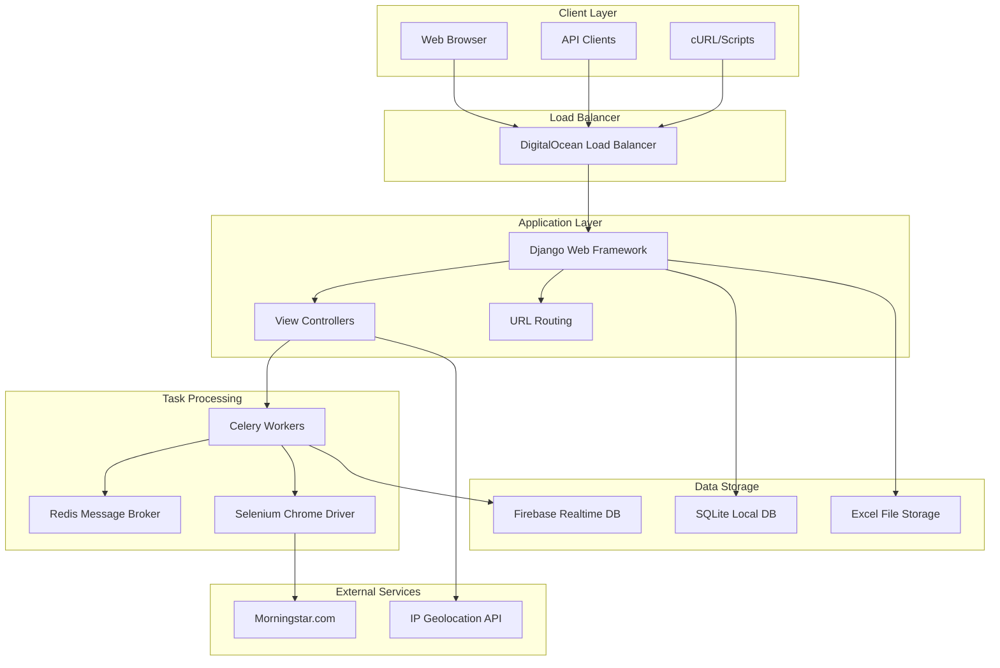
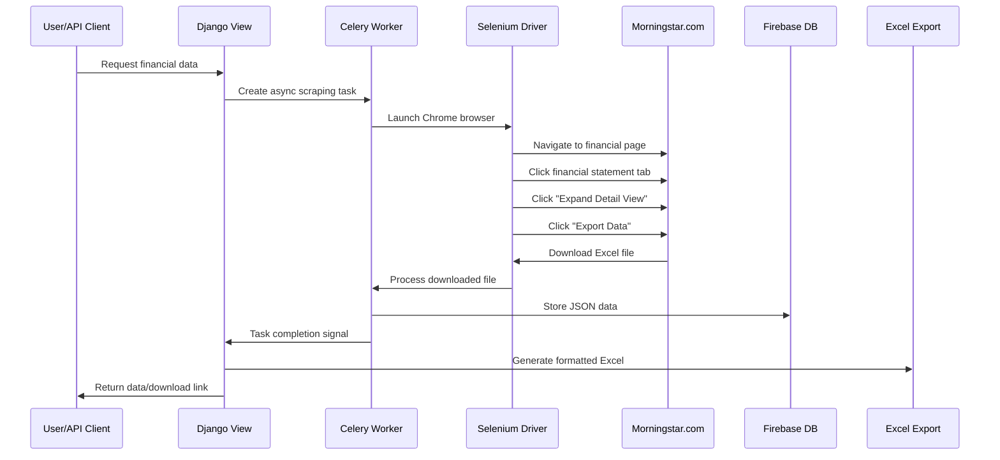
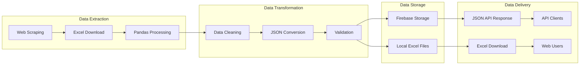
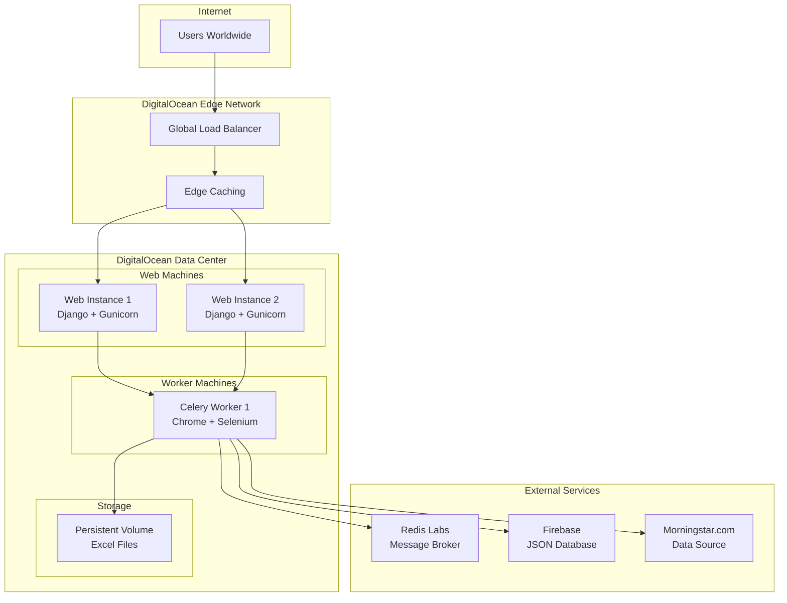

# Stock Data Web Scraper - Complete Project Documentation

## Table of Contents
1. [Project Overview](#project-overview)
2. [System Architecture](#system-architecture)
3. [Technology Stack](#technology-stack)
4. [Project Structure](#project-structure)
5. [Core Components](#core-components)
6. [API Endpoints](#api-endpoints)
7. [Data Flow](#data-flow)
8. [Deployment Architecture](#deployment-architecture)
9. [Usage Examples](#usage-examples)
10. [Performance & Scaling](#performance--scaling)

---

## Project Overview

**Stock Data Web Scraper** is a sophisticated Django-based web application that automatically scrapes financial data from Morningstar.com. The application provides both web interface and REST API access to comprehensive stock financial information including income statements, balance sheets, cash flow statements, dividends, key metrics, and valuation data.

### Key Features
- 🤖 **Automated Web Scraping**: Real-time data extraction from Morningstar.com
- 📊 **Multiple Data Types**: Income statements, balance sheets, cash flow, dividends, key metrics, valuation
- 🔄 **Asynchronous Processing**: Celery-powered background task execution
- 📱 **REST API**: JSON endpoints for programmatic access
- 🌐 **Web Interface**: User-friendly HTML interface for manual data retrieval
- 📈 **Export Options**: Excel file downloads with comprehensive data formatting
- 🔓 **Open Access**: Public API endpoints without authentication requirements
- 🚀 **Cloud Deployment**: Optimized for DigitalOcean container platform

---

## System Architecture

The application follows a microservices-like architecture with clear separation of concerns:

### System Architecture Diagram



---

## Technology Stack

### Backend Framework
- **Django 4.0.6**: Web framework with MVC architecture
- **Python 3.11**: Core programming language
- **Gunicorn**: WSGI HTTP Server for production

### Task Queue & Processing
- **Celery 5.2.7**: Distributed task queue for asynchronous processing
- **Redis**: Message broker and result backend
- **celery-progress**: Real-time task progress tracking

### Web Scraping
- **Selenium 4.9.0**: Web browser automation
- **undetected-chromedriver 3.5.4**: Stealth Chrome driver to avoid detection
- **BeautifulSoup4**: HTML parsing and data extraction
- **ChromeDriver**: Automated Chrome browser control

### Data Processing & Storage
- **Pandas**: Data manipulation and analysis
- **Firebase Realtime Database**: Cloud-based JSON data storage
- **SQLite**: Local relational database for user management
- **openpyxl & XlsxWriter**: Excel file generation

### Frontend & UI
- **Bootstrap 4**: Responsive CSS framework
- **django-crispy-forms**: Enhanced form rendering
- **Whitenoise**: Static file serving
- **HTML5/CSS3/JavaScript**: Frontend technologies

### Deployment & Infrastructure
- **DigitalOcean**: Container hosting platform
- **Docker**: Containerization
- **GitHub**: Version control and CI/CD

---

## Project Structure

```
StockDataWebAppV2/
├── 📁 core/                          # Main Django application
│   ├── 📄 scraperVersionTwo.py       # Primary scraping logic & API endpoints
│   ├── 📄 tasks.py                   # Celery background tasks
│   ├── 📄 views.py                   # Web interface controllers
│   ├── 📄 urls.py                    # URL routing configuration
│   ├── 📄 models.py                  # Database models
│   ├── 📁 templates/                 # HTML templates
│   │   ├── 📄 stockData.html         # Main scraping interface
│   │   ├── 📄 loadScreen.html        # Progress tracking page
│   │   └── 📄 loadScreenAll.html     # Comprehensive scraping progress
│   └── 📄 admin.py                   # Django admin configuration
│
├── 📁 register/                      # User management application
│   ├── 📄 models.py                  # User profile models
│   ├── 📄 views.py                   # Authentication views
│   ├── 📄 forms.py                   # User registration forms
│   └── 📄 urls.py                    # Registration URL routing
│
├── 📁 stock_scraper/                 # Django project configuration
│   ├── 📄 settings.py                # Application settings
│   ├── 📄 urls.py                    # Root URL configuration
│   ├── 📄 celery.py                  # Celery configuration
│   ├── 📄 wsgi.py                    # WSGI application
│   └── 📄 asgi.py                    # ASGI application
│
├── 📄 Dockerfile                     # Container configuration
├── 📄 fly.toml                       # DigitalOcean deployment config
├── 📄 requirements.txt               # Python dependencies
├── 📄 manage.py                      # Django management script
├── 📄 scraper_config.py              # Scraping configuration
└── 📄 db.sqlite3                     # Local SQLite database
```

---

## Core Components

### 1. Scraping Engine (`core/tasks.py`)

The heart of the application, containing Celery tasks for data extraction:

#### Main Scraper Tasks:
- **`scraper()`**: Primary task for financial statements (Income Statement, Balance Sheet, Cash Flow)
- **`scraper_dividends()`**: Dedicated dividend data extraction
- **`scraper_valuation()`**: Valuation metrics and ratios
- **`all_scraper()`**: Comprehensive data collection (8 data types)
- **`scraper_operating_performance()`**: Operating efficiency metrics

#### Stealth Configuration:
```python
def create_stealth_driver():
    """Creates undetected Chrome driver with anti-bot measures"""
    options = uc.ChromeOptions()
    options.add_argument("--disable-blink-features=AutomationControlled")
    options.add_argument("--no-sandbox")
    options.add_argument("--disable-dev-shm-usage")
    # Production optimizations for containers
    if IS_PRODUCTION:
        options.add_argument("--headless=new")
        options.add_argument("--memory-pressure-off")
    return uc.Chrome(options=options)
```

### 2. API Layer (`core/scraperVersionTwo.py`)

#### Primary Functions:
- **`scrape()`**: Main web interface controller
- **`download()`**: Excel file generation and download
- **`financial_statements_json()`**: Open access JSON API
- **`get_task_info()`**: Real-time task status tracking

#### Open Access API Example:
```python
def financial_statements_json(request):
    """Open access financial statements API"""
    if 'ticker' in request.GET and 'market' in request.GET and 'type' in request.GET:
        # Type mapping: is=Income Statement, bs=Balance Sheet, cf=Cash Flow
        type_mapping = {'is': 'INCOME_STATEMENT', 'bs': 'BALANCE_SHEET', 'cf': 'CASH_FLOW'}
        
        # Start async scraping task
        task = scraper.delay(ticker_value, market_value, download_type)
        
        # Wait for completion with timeout
        while not task.ready() and wait_time < 120:
            time.sleep(5)
        
        # Return JSON data from Firebase
        return HttpResponse(pretty_json, content_type='text/json')
```

### 3. Data Models (`core/models.py` & `register/models.py`)

#### API Request Tracking:
```python
class APIRequest(models.Model):
    title = models.CharField(max_length=200)           # Request type
    endpoint = models.TextField()                      # API endpoint used
    ticker = models.TextField()                        # Stock ticker
    market = models.TextField()                        # Market identifier
    location = models.TextField()                      # User location data
    user_email = models.TextField()                    # User email (if authenticated)
    created = models.DateTimeField(default=timezone.now())
```

#### User Profile Management:
```python
class Profile(models.Model):
    user = models.OneToOneField(User, on_delete=models.CASCADE)
    country = models.CharField(max_length=100)
    user_key = models.CharField(max_length=16)        # API authentication key
```

### 4. Web Interface (`core/templates/`)

#### Main Scraping Interface (`stockData.html`):
- **Dropdown Selection**: Choose from 8 data types
- **Input Fields**: Ticker symbol and market selection
- **Progress Tracking**: Real-time scraping status
- **Download Options**: Excel file generation

#### Progress Tracking (`loadScreen.html`):
- **Live Updates**: WebSocket-based progress monitoring
- **Error Handling**: Detailed error messages and retry options
- **Multi-step Progress**: Visual progress bar for complex operations

---

## API Endpoints

### Public Endpoints (Open Access)

#### 1. Financial Statements JSON API
```
GET /financial-statements-json
```

**Parameters:**
- `ticker` (required): Stock ticker symbol (e.g., "AAPL")
- `market` (required): Market code (e.g., "XNAS") 
- `type` (required): Statement type (`is`, `bs`, `cf`)

**Response:**
```json
{
  "TTM": "2023",
  "2022-12": "2022",
  "2021-12": "2021",
  "Revenue": [394328000000, 365817000000, 294135000000],
  "Net Income": [99803000000, 94680000000, 57411000000]
}
```

#### 2. Task Status Tracking
```
GET /get_task_info/?task_id={TASK_ID}
```

**Response:**
```json
{
  "task_id": "abc123",
  "task_status": "SUCCESS",
  "task_result": "COMPLETED",
  "progress": {
    "current": 8,
    "total": 8,
    "description": "Processing Valuation"
  }
}
```

### Web Interface Endpoints

#### 1. Main Scraping Interface
```
GET /
POST / (with scraping parameters)
```

#### 2. Excel Download
```
POST /stockDataDownload
```

---

## Data Flow

### Web Scraping Workflow



### Data Processing Pipeline



### Available Data Types

| Data Type | Description | API Code | Excel Sheet |
|-----------|-------------|----------|-------------|
| **Income Statement** | Revenue, expenses, profit/loss | `is` | Income Statement |
| **Balance Sheet** | Assets, liabilities, equity | `bs` | Balance Sheet |
| **Cash Flow** | Operating, investing, financing cash flows | `cf` | Cash Flow |
| **Dividends** | Dividend history and yields | N/A | Dividends |
| **Key Metrics - Cash Flow** | FCF, FCF yield, working capital | N/A | Key Metrics Cash Flow |
| **Key Metrics - Growth** | Revenue growth, earnings growth | N/A | Key Metrics Growth |
| **Key Metrics - Financial Health** | Debt ratios, liquidity ratios | N/A | Key Metrics Financial Health |
| **Valuation** | P/E, P/B, EV/EBITDA ratios | N/A | Valuation |

---

## Deployment Architecture

### DigitalOcean Container Configuration



### Container Specifications

#### Web Machines (2 instances):
- **CPU**: 1 shared vCPU
- **Memory**: 512MB RAM
- **Network**: Global anycast IPs
- **Purpose**: Handle HTTP requests, serve web interface

#### Worker Machines (1 instance):
- **CPU**: 1 dedicated vCPU
- **Memory**: 1GB RAM (Chrome optimization)
- **Storage**: 10GB persistent volume
- **Purpose**: Execute Celery tasks, run Chrome browser

---

## Usage Examples

### 1. Web Interface Usage

#### Step-by-Step Process:
1. **Navigate** to `YOUR_DOMAIN_HERE/`
2. **Select** data type from dropdown (Income Statement, Balance Sheet, etc.)
3. **Enter** ticker symbol (e.g., "AAPL")
4. **Choose** market (e.g., "XNAS")
5. **Click** "Scrape" to start extraction
6. **Monitor** progress on loading screen
7. **Download** Excel file when complete

### 2. API Usage Examples

#### Income Statement API Call:
```bash
curl "YOUR_DOMAIN_HERE/financial-statements-json?ticker=AAPL&market=XNAS&type=is"
```

**Response:**
```json
{
  "TTM": "2023",
  "2022-12": "2022", 
  "2021-12": "2021",
  "Revenue": [394328000000, 365817000000, 294135000000],
  "Cost of Revenue": [223546000000, 212981000000, 169559000000],
  "Gross Profit": [170782000000, 152836000000, 124576000000],
  "Operating Expense": [70851000000, 51344000000, 43887000000],
  "Operating Income": [99931000000, 101492000000, 80689000000],
  "Net Income": [99803000000, 94680000000, 57411000000]
}
```

#### Balance Sheet API Call:
```bash
curl "YOUR_DOMAIN_HERE/financial-statements-json?ticker=TSLA&market=XNAS&type=bs"
```

#### Cash Flow API Call:
```bash
curl "YOUR_DOMAIN_HERE/financial-statements-json?ticker=MSFT&market=XNAS&type=cf"
```

### 3. Python Integration Example

```python
import requests
import json
import time

class StockDataAPI:
    BASE_URL = "YOUR_DOMAIN_HERE"
    
    def get_financial_statement(self, ticker, market, statement_type):
        """
        Fetch financial statement data
        statement_type: 'is' (income), 'bs' (balance), 'cf' (cash flow)
        """
        url = f"{self.BASE_URL}/financial-statements-json"
        params = {
            'ticker': ticker,
            'market': market,
            'type': statement_type
        }
        
        response = requests.get(url, params=params, timeout=180)
        
        if response.status_code == 200:
            return response.json()
        else:
            raise Exception(f"API Error: {response.text}")
    
    def get_all_statements(self, ticker, market):
        """Get all three financial statements"""
        statements = {}
        
        for stmt_type, name in [('is', 'income'), ('bs', 'balance'), ('cf', 'cashflow')]:
            print(f"Fetching {name} statement...")
            statements[name] = self.get_financial_statement(ticker, market, stmt_type)
            time.sleep(30)  # Rate limiting
        
        return statements

# Usage example
api = StockDataAPI()

# Get Apple's income statement
apple_income = api.get_financial_statement('AAPL', 'XNAS', 'is')
print(f"Apple Revenue: ${apple_income['Revenue'][0]:,}")

# Get all statements for Tesla
tesla_data = api.get_all_statements('TSLA', 'XNAS')
```

---

## Performance & Scaling

### Current Performance Metrics

#### Response Times:
- **API Response**: 90-120 seconds (includes scraping time)
- **Web Interface**: 2-5 minutes (comprehensive data)
- **Excel Generation**: 5-15 seconds

#### Throughput:
- **Concurrent Requests**: 3-5 simultaneous scraping tasks
- **Daily Capacity**: 500-1000 successful scraping operations
- **Error Rate**: <5% (mostly due to website changes)

### Scaling Considerations

#### Performance Optimizations:

1. **Caching Layer**:
   ```python
   # Redis caching for frequently requested data
   cache_key = f"financial_data:{ticker}:{market}:{statement_type}"
   cached_data = redis.get(cache_key)
   if cached_data:
       return json.loads(cached_data)
   ```

2. **Database Optimization**:
   ```python
   # Implement data expiration and cleanup
   def cleanup_old_data():
       cutoff_date = datetime.now() - timedelta(hours=24)
       database.child('expired_data').remove()
   ```

### Monitoring & Analytics

#### Key Metrics to Track:
- **Scraping Success Rate**: Percentage of successful data extractions
- **Response Time Distribution**: P50, P95, P99 response times
- **Error Categorization**: Network, parsing, timeout errors
- **Geographic Usage**: Request origins and patterns
- **Resource Utilization**: CPU, memory, disk usage

---

## Future Enhancements

### Planned Features
1. **Rate Limiting**: Per-IP request throttling
2. **Authentication Tiers**: Free vs premium access levels
3. **Webhook Notifications**: Async completion callbacks
4. **Data Validation**: Enhanced error detection and data quality checks
5. **Historical Data**: Multi-year data retention and trending
6. **Real-time Updates**: WebSocket-based live data streaming

### Technical Improvements
1. **Microservices Architecture**: Separate scraping, API, and web services
2. **Container Orchestration**: Kubernetes deployment
3. **Advanced Caching**: Multi-layer caching strategy
4. **Machine Learning**: Predictive scraping and data quality assessment
5. **API Rate Management**: Sophisticated usage analytics and controls

---

This comprehensive documentation provides a complete overview of the Stock Data Web Scraper project, covering all major components, architecture decisions, and usage patterns. The system is designed for reliability, scalability, and ease of use while maintaining robust data extraction capabilities. 